# Event Storming Workflow – Sterilization Booking

**Source:** Event Storming session (veterinary clinic case study).  
**Purpose:** Reference workflow for the sterilization appointment booking process, from user identification through scheduling (“The Tetris”) to confirmation and instructions.

---

## Legend (Event Storming Elements)

| Element | Meaning |
|--------|--------|
| **Command** (blue) | User/system action or intent |
| **Event** (orange) | Something that happened (domain event) |
| **Policy / Rule** (purple) | Business rule or decision |
| **Aggregate / Data** (yellow) | Bounded context or data entity |
| **Read model** (green) | Query/view used for display or decisions |
| **External** (pink) | External system or actor |

---

## Workflow Diagram

```mermaid
graph TD
    %% Styles for Event Storming Elements
    classDef command fill:#0052cc,stroke:#fff,stroke-width:2px,color:#fff;
    classDef event fill:#ff9900,stroke:#fff,stroke-width:2px,color:#fff;
    classDef policy fill:#b300b3,stroke:#fff,stroke-width:2px,color:#fff;
    classDef aggregate fill:#ffff00,stroke:#333,stroke-width:2px,color:#000;
    classDef readmodel fill:#ccffcc,stroke:#333,stroke-width:2px,color:#000;
    classDef external fill:#ffccff,stroke:#333,stroke-width:2px,color:#000;

    %% Legend
    subgraph Legend
        L_CMD[Command]:::command
        L_EVT[Event]:::event
        L_POL[Policy / Rule]:::policy
        L_AGG[Aggregate / Data]:::aggregate
    end

    %% Flow
    Start((Start)) --> CMD_Ident[Identify User / Intent]:::command
    CMD_Ident --> EVT_UserIdent[User Identified]:::event

    EVT_UserIdent --> POL_CheckPets{Check # Pets}:::policy
    POL_CheckPets -- "> 1 Pet" --> EVT_Call[Redirect to Phone Call]:::event
    EVT_Call --> EndCall((End))

    POL_CheckPets -- "1 Pet" --> CMD_AskNew[Ask: Is it a new pet?]:::command
    CMD_AskNew --> EVT_NewPetStatus[Pet Status Received]:::event

    EVT_NewPetStatus -- "Yes / Unknown" --> CMD_AskDetails[Ask Species, Sex, Weight]:::command

    CMD_AskDetails --> EVT_DetailsReceived[Details Received]:::event
    EVT_DetailsReceived --> POL_Species{Species?}:::policy

    %% CAT PATH
    POL_Species -- "Cat" --> CMD_AskHeat_Cat[Ask: In Heat? - Info]:::command
    CMD_AskHeat_Cat --> EVT_CatInfo[Cat Info Complete]:::event
    EVT_CatInfo --> POL_CalcTime_Cat[Policy: Calculate Time\nMale: 12m, Female: 15m]:::policy

    %% DOG PATH
    POL_Species -- "Dog" --> CMD_AskHeat_Dog[Ask: In Heat?]:::command
    CMD_AskHeat_Dog --> POL_CheckHeat_Dog{In Heat?}:::policy
    POL_CheckHeat_Dog -- "Yes" --> EVT_RejectHeat[Reject: Wait 2 months]:::event
    EVT_RejectHeat --> EndHeat((End))

    POL_CheckHeat_Dog -- "No" --> POL_CalcTime_Dog[Policy: Calculate Time\nMale: 30m, Female: 45-70m based on weight]:::policy

    %% MERGE PATHS
    POL_CalcTime_Cat --> CMD_CheckAvail[Command: Check Availability]:::command
    POL_CalcTime_Dog --> CMD_CheckAvail

    %% THE TETRIS (SCHEDULING LOGIC)
    subgraph The_Tetris_Algorithm
        CMD_CheckAvail --> AGG_Agenda[Agenda Aggregate]:::aggregate
        AGG_Agenda --> POL_Rule1{Rule 1:\nDaily Limit <= 240min?}:::policy
        POL_Rule1 -- "Yes" --> POL_Rule2{Rule 2:\nIf Dog, Total Dogs <= 2?}:::policy
        POL_Rule1 -- "No" --> EVT_NoSlot[Slot Unavailable]:::event
        POL_Rule2 -- "No" --> EVT_NoSlot
        POL_Rule2 -- "Yes" --> EVT_SlotFound[Valid Slots Found]:::event
    end

    EVT_NoSlot --> CMD_NextDay[Check Next Day]:::command
    CMD_NextDay --> AGG_Agenda

    EVT_SlotFound --> CMD_ShowDates[Show Available Dates]:::command
    CMD_ShowDates --> EVT_DatesShown[Dates Displayed]:::event
    EVT_DatesShown --> CMD_SelectDate[User Selects Date]:::command
    CMD_SelectDate --> EVT_DateSelected[Date Selected]:::event

    %% CONFIRMATION & EXTRAS
    EVT_DateSelected --> CMD_AskExtras[Ask: Microchip / Rabies?]:::command
    CMD_AskExtras --> EVT_ExtrasRecorded[Extras Recorded]:::event

    EVT_ExtrasRecorded --> POL_AssignWindow{Assign Delivery Window}:::policy
    POL_AssignWindow -- "Cat" --> READ_WindowCat[Window: 08:00 - 09:00]:::readmodel
    POL_AssignWindow -- "Dog" --> READ_WindowDog[Window: 09:00 - 10:30]:::readmodel

    READ_WindowCat --> CMD_FinalConfirm[Confirm Appointment]:::command
    READ_WindowDog --> CMD_FinalConfirm

    CMD_FinalConfirm --> EVT_ApptBooked[Appointment Booked]:::event

    EVT_ApptBooked --> CMD_SendInstructions[Send Fasting Instructions & Consent Form]:::command
    CMD_SendInstructions --> EndSuccess((End))
```

---

## Summary of the Flow

1. **Start → User identification:** Identify user/intent; if more than one pet, redirect to phone call.
2. **Pet onboarding:** Ask if new pet; if yes/unknown, collect species, sex, weight.
3. **Species split:**
   - **Cat:** Ask in-heat info → calculate time (male 12 min, female 15 min).
   - **Dog:** Ask in heat → if yes, reject (wait 2 months); if no, calculate time (male 30 min, female 45–70 min by weight).
4. **The Tetris (scheduling):** Check agenda; apply Rule 1 (daily limit ≤ 240 min) and Rule 2 (if dog, total dogs ≤ 2). If no slot, check next day; if slot found, show dates.
5. **Date selection → Extras:** User selects date; ask microchip/rabies; assign delivery window (Cat 08:00–09:00, Dog 09:00–10:30).
6. **Confirmation:** Confirm appointment → send fasting instructions and consent form.
